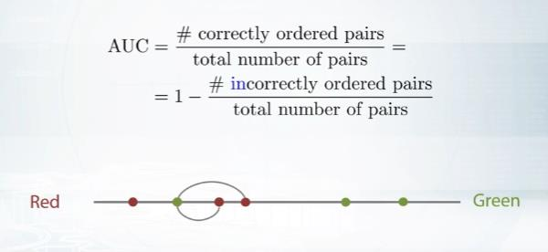

# week3

## <Metrics optimization>

#### Metrics Motivation

* Why there are so many metrics?
  * Different metrics for different problems

* Why should we care about metric in competitions?
  * It is how the competotors are ranked

#### MAE vs MSE

* Do you have outliers in the data?
  * Use MAE

* Are you sure they are outliers?
  * USe MAE

* Or they are just unexpected values we should still care about?
  * Use MSE

#### Discussed the following metrics:

* MSE, RMSE, R-squared 
  * They are the same from optimization perspective

* MAE
  * Robust to outliers

#### DIscussed the metrics, sensitive to relative errors:

* MSPE
  * Weighted version of MSE
* MAPE
  * Weighted version of MAE
* MSLE
  * MSE in log space

## Classification metrics

#### Logarithmic loss(log loos)

##### Area Under Curve(AUC ROC)

* Best constant - All constants give same score
* Random predictions lead to AUC = 0.5

#### Cohen's Kappa motivation

* Baseline accuaracy = 0.9

#### Loss and metric

* Target metric is what we want to optimize
* Optimizatiob loss is what model optimizes

#### Early stopping 

* Optimize metric M1, monitor metric M2 - Stop when M2 score is the best
* 

#### General approaches for metics optimization Conclusion

* Loss vs metric
* Approaches in general:
  * Just run the right model
  * Preprocess train and optimize another metic
  * Optimize another metric, prostprocess predictions
  * Write a custom loss function
  * Optimizee another metric, use early stopping

## Regression metrics optimization

#### Metrics optimization: our plan

* Regression
  * MSE, (R)MSE, R-squared, MAE, (R)MSPE, MAPE, (R)MSLE

* MSE

* RMSE 

* R-squared

* MAE

* MSPE and MAPE

* RMSLE

## Classification metrics optimization

* Logloss
* Accuracy
* AUC
* (Quadratic weighted) Kappa

#### Logloss

* Correct probabilities: Take all objects with score e.g. ~0.8.
  * 80% of them of class 1
  * 20& of them class 0 

* Incorrect probabilities: Take all objects with score e.g. ~ 0.8
  * 50% of them of class 1
  * 50 %. of them of class 0

#### Accuracy

#### AUC(ROC)

#### Quadratic weighted Kappa

#### Conclusion

* Target metic is how competitors are scored
* Target metic VS optimization loss
* Regression metrics
  * MSE, RMSE, R-squared; MAE; MSPE, MAPE; RMSLE;

* Classification metrics
  * Accuracy, Logloss, AUC, (Quadratic weighted) Kappa

## <Mean encodings>

#### Why dose it work?

* Label endcoding gives random order, No correlation with target
* Mean encoding helps to separate zeros from ones

#### Ways to use target variable

#### Regularization

* CV loop inside training data;
* Smoothing;
* Adding random noise;
* Sorting and calculating expanding mean.

#### CV loop

* Robust and intuitive
* Usually decent results with 4-5 folds across different datasets;
* Need to be careful with extreme situations like LOO

#### Regularization.Smoothing

* Alpha controls the amount of regularization
* Only works together with some other regularization method
* 

#### Regularization.Noise

* Noise degrades the quality of encoding
* How much noise should we add?
* Usually used together with LOO

#### Regularization. Expanding mean

* Least amount of leakeage
* No hyper parameters
* Irregular encoding quality
* Built - in in CatBoost

#### Regularization. Conclusion

* There are a lot ways to regularize mean encodings
* Unending battle with target varable leakage
* CV loop or Expanding mean for practical tasks

#### Regression and multiclass

* More staticstics for regression tasks. Percentiles, std, distribution bins
* Introducing new information for one vs all classfiers in multi class tasks

#### Many-to-many relations

* Cross product of entities
* Statistics from vectors

#### Time series

* Time structure allows us to make a lot of complicated features.
* Rolling statistics of target variable

#### Interactions and numerical features

* Analyzing fitted model
* Binning numeric and selection interactions

